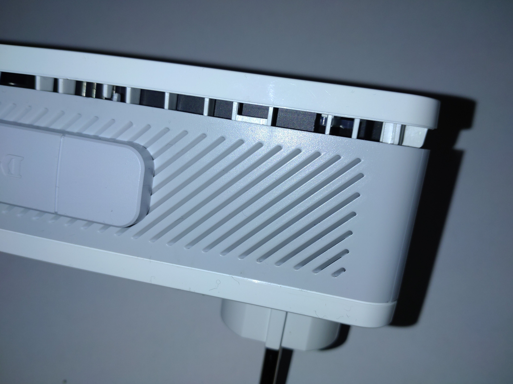
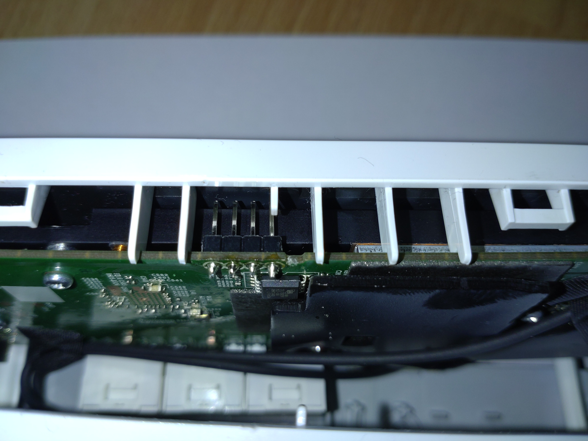

# OpenWRT image for D-Link COVR-P2500 A1

## Overview

This repository adds a build profile for D-Link COVR-P2500.  
Device configuration from [s-2's covr-2500_plctest branch](https://github.com/s-2/openwrt/tree/covr-2500_plctest).  
Build script based on [jwmullay's openwrt_wpa8630p_v2_fullmem](https://github.com/jwmullally/openwrt_wpa8630p_v2_fullmem).  

## Supported Devices

| Hardware Version |
| --- |
| `Model: COVR-P2500 Rev A1` |


## Building

Clone repository and run `make`

## Installing

### OEM Web UI
Login to http://covr.local/ (or with IP address). Navigate to Management -> Upgrade and upload factory.bin.

OEM configuration is not compatible with OpenWRT so the device can't be accessed before reset. Wait long enough to make sure upgrade is finished and reset device with reset button. Use ethernet port 1 or 2 (in the middle of the device) to access LUCI Web UI on http://192.168.1.1/.

### OEM Recovery UI (Not working)
Hold reset while powering device and access the Recovery UI on http://192.168.0.50/. Upload recovery.bin

### From OpenWRT 18.06-SNAPSHOT r7704-9ee8c8daf4 (http://www.netadair.de/openwrt/)
!!! DO NOT FORCE FLASH sysupgrade.bin

Release is not compatible with old loader. Force flash with sysupgrade-openwrt1806.bin that contains also new loader.
```
sysupgrade -n -F sysupgrade-openwrt1806.bin
```

### u-boot serial recovery
Setup tftpd server on 192.168.0.100 with recovery.bin named as 3200A8C0.img.
Start device with serial console attached and access u-boot console by pressing any key when promted.
Install image with commands:
```
tftpboot
erase 0x9f050000 +$filesize
cp.b $fileaddr 0x9f050000 $filesize
reset
```

## PLC

SSH to device and run `/etc/init.d/plc setup`. Make selections and start PLC with `/etc/init.d/plc start`. Alternatively you can download plc scripts from [netadair.de](http://www.netadair.de/openwrt/)

### Setup example

1. (optional) Download QCA75XX-2.10.0.0032_m
odules_5-6_stripped.nvm
```
root@covrp2500_1:~# mkdir /etc/plc
root@covrp2500_1:~# cd /etc/plc/
root@covrp2500_1:/etc/plc# wget ???/QCA75XX-2.10.0.0032_modules_5-6_stripped.nvm
```
2. Run PLC setup helper
```
root@covrp2500_1:/etc/plc# /etc/init.d/plc setup
Download original firmware and extract files from /lib/plc to /etc/plc [y|n] y
Downloading 'http://pmdap.dlink.com.tw/PMD/GetAgileFile?itemNumber=FIR1800225&fileName=COVRP2500A1_FW101b08_decrypted.bin&fileSize=1.5990457E7;1.5992229E7;65141.0;'
Connecting to 60.248.210.49:80
Writing to 'COVRP2500A1_FW101b08_decrypted.bin'
COVRP2500A1_FW101b08 15615k --:--:-- ETA
Download completed (15990457 bytes)
Parallel unsquashfs: Using 1 processor
4 inodes (6 blocks) to write

[===================================================================|] 6/6 100%

created 4 files
created 3 directories
created 0 symlinks
created 0 devices
created 0 fifos
created 0 sockets
1) /etc/plc/COVRP2500AVA1_PIB100EU_WM.pib
2) /etc/plc/COVRP2500AVA1_PIB100NA_WM.pib
3) /etc/plc/COVRP2500AVA1_PIB100SG_WM.pib
Select PibPath [1-3]: 1
1) /etc/plc/MAC-7500-v2.2.2-03-X-CS.nvm
2) /etc/plc/QCA7500-2.10.0032_modules_5-6_stripped.nvm
Select NvmPath [1-2]: 2
NetworkPasswd (leave empty to use default plc_networkpwd): SomePassword
Enable plc [0-1]: 1
Automatically add to br-lan bridge [0-1]: 0
```

3. Start plc service
```
root@covrp2500_1:/etc/plc# /etc/init.d/plc start
```

4. Check PLC connection status after another device connected

NOTE! plctool does not work with bridge

```
root@covrp2500_1:/etc/plc# plctool -i eth0.3 -m
eth0.3 00:B0:52:00:00:01 Fetch Network Information
eth0.3 XX:XX:XX:XX:XX:X Found 1 Network(s)

source address = XX:XX:XX:XX:XX:XX

	network->NID = ZZ:ZZ:ZZ:ZZ:ZZ:ZZ:ZZ
	network->SNID = 15
	network->TEI = 1
	network->ROLE = 0x02 (CCO)
	network->CCO_DA = XX:XX:XX:XX:XX:XX
	network->CCO_TEI = 1
	network->STATIONS = 1

		station->MAC = YY:YY:YY:YY:YY:YY
		station->TEI = 2
		station->BDA = F4:B5:20:44:BC:DE
		station->AvgPHYDR_TX = 009 mbps Primary
		station->AvgPHYDR_RX = 009 mbps Primary

```


## Serial
Remove 4 skrews to open the device.



Remove 3 skrews holding upper PCB.


Solder 4 or 3 pin header (P3V3 not required). The PCB has labels GND, U-TX, U-RX and P3V3. By cutting a suitable hole in the case, the serial connector can be used after the case is closed.


Connect USB-TTL adapter to header (CND -> GND, RX -> U-TX and TX -> U-RX). Use baud rate 115200 (e.g. `screen /dev/ttyUSB0 115200`).

For some reason serial output is not readable on bootloader, but I managed to get output almost readable with `screen /dev/ttyUSB1 115200,cs7,cstopb`. Sending commands was not working with this configuration so I attached second USB-TTL adapter with only GND and RX connected so I got readable output on another terminal and sent commands with another terminal.
